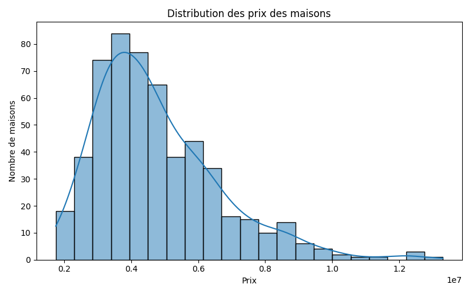
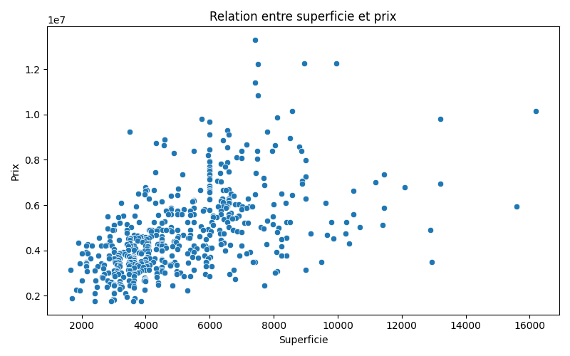
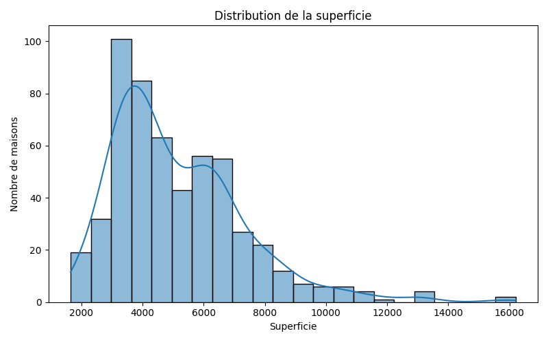

# 🏠 House Price Prediction

### Machine Learning project for predicting house prices from property characteristics

<p align="center">

**Python • Pandas • NumPy • Scikit-learn • Streamlit • Joblib**

</p>

---

## 📌 Project Overview

**House Price Prediction** is an end-to-end Machine Learning project developed to predict the price of a house based on its characteristics.

The project covers the complete Machine Learning workflow:

**Data → Preprocessing → Exploratory Analysis → Model Training → Evaluation → Prediction → Web Application**

A **Streamlit application** allows users to enter the characteristics of a house and obtain an estimated price.

---

## 🎯 Objectives

* Analyze a real-world housing dataset
* Clean and preprocess the data
* Explore relationships between house features and prices
* Encode categorical variables
* Train a Machine Learning regression model
* Evaluate model performance
* Save the trained model with Joblib
* Build an interactive prediction application with Streamlit

---

## 📊 Dataset

The project uses the `Housing.csv` dataset.

| Information       |                Value |
| ----------------- | -------------------: |
| Houses            |              **545** |
| Original features |               **12** |
| Target            |      **House Price** |
| Training data     | **436 houses (80%)** |
| Testing data      | **109 houses (20%)** |
| Original currency |              **PKR** |

### Features

| Feature            | Description              |
| ------------------ | ------------------------ |
| `area`             | House area               |
| `bedrooms`         | Number of bedrooms       |
| `bathrooms`        | Number of bathrooms      |
| `stories`          | Number of stories        |
| `mainroad`         | Main road access         |
| `guestroom`        | Guest room availability  |
| `basement`         | Basement availability    |
| `hotwaterheating`  | Hot water heating        |
| `airconditioning`  | Air conditioning         |
| `parking`          | Number of parking spaces |
| `prefarea`         | Preferred area           |
| `furnishingstatus` | Furnishing status        |
| `price`            | House price              |

> **Note:** The original dataset contains house prices expressed in Pakistani Rupees (PKR).

---

## 🔄 Machine Learning Workflow

```text
┌─────────────────────┐
│   Housing Dataset   │
└──────────┬──────────┘
           ↓
┌─────────────────────┐
│ Data Preprocessing  │
│ Cleaning & Encoding │
└──────────┬──────────┘
           ↓
┌─────────────────────┐
│ Exploratory Analysis│
│      & EDA          │
└──────────┬──────────┘
           ↓
┌─────────────────────┐
│ Train / Test Split  │
│      80% / 20%      │
└──────────┬──────────┘
           ↓
┌─────────────────────┐
│  Linear Regression  │
│    Model Training   │
└──────────┬──────────┘
           ↓
┌─────────────────────┐
│  Model Evaluation   │
│ MAE • RMSE • R²     │
└──────────┬──────────┘
           ↓
┌─────────────────────┐
│   Saved Model       │
│      Joblib         │
└──────────┬──────────┘
           ↓
┌─────────────────────┐
│ Streamlit Web App   │
└─────────────────────┘
```

---

## 🧹 Data Preprocessing

The following steps were performed:

* Loaded the dataset using **Pandas**
* Inspected the dataset structure
* Analyzed price distributions
* Explored relationships between features and price
* Converted binary categorical values:

```text
yes → 1
no  → 0
```

* Applied **One-Hot Encoding** to `furnishingstatus`
* Separated features `X` from target `y`
* Split the dataset into training and testing sets

### Dataset Split

**80% Training:** 436 houses
**20% Testing:** 109 houses

---

## 📈 Exploratory Data Analysis

Several visualizations were created to better understand the dataset.

### House Price Distribution



### Area vs Price



### Area Distribution



The analysis showed that house prices are **right-skewed**, with most observations concentrated in the lower and middle price ranges and fewer expensive houses.

---

## 🤖 Machine Learning Model

### Linear Regression

The selected Machine Learning model is **Linear Regression**.

It was chosen because the objective is to predict a **continuous numerical value**: the price of a house.

The model learns the relationship between the house characteristics and their corresponding prices using the training dataset.

---

## 📊 Model Performance

The model was evaluated using three regression metrics:

| Metric       |       Result |
| ------------ | -----------: |
| **MAE**      |   970,043.40 |
| **RMSE**     | 1,324,506.96 |
| **R² Score** |    **0.653** |

### R² Score

The model achieved an **R² score of approximately 0.653**, meaning that it explains around **65.3% of the variation in house prices** on the test dataset.

---

## 💾 Model Persistence

After training, the Linear Regression model is saved using **Joblib**.

```text
models/
└── house_price_model.pkl
```

The saved `.pkl` file allows the application to load the trained model directly without retraining it every time.

---

## 🔮 Prediction Process

The prediction pipeline works as follows:

```text
House characteristics
        ↓
Categorical encoding
        ↓
Feature organization
        ↓
Trained Linear Regression model
        ↓
Predicted house price
```

The prediction function is implemented in:

```text
source/predict.py
```

---

## 🌐 Streamlit Application

A simple interactive web application was developed using **Streamlit**.

Users can enter:

* Area
* Bedrooms
* Bathrooms
* Stories
* Parking spaces
* Main road access
* Guest room
* Basement
* Hot water heating
* Air conditioning
* Preferred area
* Furnishing status

The application then returns an estimated house price.

### Application Preview

> Add your Streamlit screenshot here.

```text
application/app.py
```

---

## 🛠️ Technologies

### Programming

`Python`

### Data Analysis

`Pandas` • `NumPy` • `Matplotlib` • `Seaborn`

### Machine Learning

`Scikit-learn`

### Model Persistence

`Joblib`

### Application

`Streamlit`

### Development

`VS Code`

---

## 📁 Project Structure

```text
house-price-prediction/
│
├── data/
│   ├── original/
│   │   └── Housing.csv
│   └── cleaned/
│       └── Housing_cleaned.csv
│
├── analysis/
│
├── source/
│   ├── data_preprocessing.py
│   ├── predict.py
│   └── train_model.py
│
├── models/
│   └── house_price_model.pkl
│
├── application/
│   └── app.py
│
├── results/
│   └── figures/
│       ├── price_distribution.png
│       ├── area_distribution.png
│       └── area_vs_price.png
│
├── configuration/
│
├── requirements.txt
├── README.md
├── .gitignore
└── LICENSE
```

---

## 🚀 Installation

Clone the repository:

```bash
git clone https://github.com/mhammedbenabderrahman/house-price-prediction.git
```

Move into the project directory:

```bash
cd house-price-prediction
```

Install the required dependencies:

```bash
pip install -r requirements.txt
```

---

## ▶️ Run the Application

From the project root:

```bash
python -m streamlit run application/app.py
```

The Streamlit application will then open in your browser.

---

## 🧪 Example Prediction

Example input:

| Feature           | Value     |
| ----------------- | --------- |
| Area              | 5000 m²   |
| Bedrooms          | 3         |
| Bathrooms         | 2         |
| Stories           | 2         |
| Parking           | 1         |
| Main road         | Yes       |
| Guest room        | No        |
| Basement          | No        |
| Hot water heating | No        |
| Air conditioning  | Yes       |
| Preferred area    | Yes       |
| Furnishing        | Furnished |

The application uses these characteristics as input to the trained Linear Regression model and returns an estimated house price.

---

## 📚 What I Learned

Through this project, I strengthened my practical understanding of:

* Data cleaning and preprocessing
* Exploratory Data Analysis
* Categorical variable encoding
* Regression Machine Learning
* Model evaluation
* Model serialization with Joblib
* Building a Machine Learning application with Streamlit
* Structuring a Data Science project for deployment

---

## 🔮 Future Improvements

Possible improvements include:

* Testing additional regression algorithms
* Hyperparameter tuning
* Feature scaling and advanced feature engineering
* Improving model performance
* Adding more visualizations
* Deploying the application online

---

## 👨‍💻 Author

### Mhammed Benabderrahman

**Data Science Graduate**

Interested in:

`Data Science` • `Data Analysis` • `Machine Learning` • `Python`

---

## 📄 License

This project is licensed under the **MIT License**.
